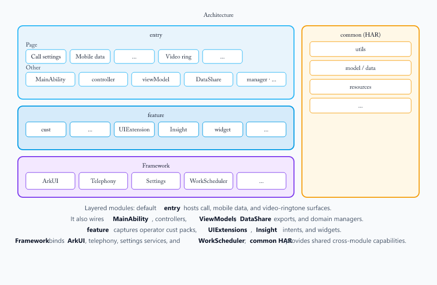

# CallSetting

-   [Introduction](#section11660541593)
    -   [Content](#section_intro_content_en)
    -   [Architecture diagram](#section_arch_diagram_en)
-   [File Tree](#section161941989596)
-   [Repositories Involved](#section1371113476307)

## Introduction

### Content

The call settings application is a pre-installed system application in the OpenHarmony standard system. Its core functions have been fully realized in areas such as incoming call notifications, ringtone management, call record organization, supplementary services, and network configuration.

### Core features:
   1. **Unlock incoming call notifications**: Supports two notification styles - full-screen and banner. Users can flexibly choose according to the current usage scenario, balancing immersive call answering and low-disturbance needs.
   2. **Incoming call ringtone**: Offers a variety of ringtone settings options, including system ringtone, video ringtone, and supports "no ringtone" mode, meeting users' personalized incoming call reminder preferences.
   3. **Call record consolidation**: Supports two consolidation methods - by contact and by time, helping users browse and manage call history records more efficiently, improving information search efficiency.
   4. **IMS supplementary services**: Integrates voicemail function, realizing message service in non-answer scenarios based on IMS network, enhancing the completeness and reliability of communication services.
   5. **Unanswered call notifications**: The system can actively prompt unanswered calls, ensuring users are promptly informed and can return the call, avoiding missing important contact information.
   6. **Incoming call rejection SMS**: Users can quickly send a preset SMS when rejecting a call, politely informing the other party of the reason for not being able to answer, enhancing social communication etiquette and experience.
   7. **Call settings**: Covers a rich set of phone and network configuration items, including: quick dialing, call quick operation, power button to end call, ringtone setting page supports vibration switch, mobile data switch, access point name (APN), network mode. These settings meet users' refined control needs for call habits, network connection and operational strategies.

### Architecture diagram

1. Layered modules: default **entry** hosts call, mobile data, and video-ringtone surfaces.
2. It also wires **MainAbility**, controllers, **ViewModels**, **DataShare** exports, and domain managers.
3. **feature** captures operator cust packs, **UIExtensions**, **Insight** intents, and widgets.
4. **Framework** binds **ArkUI**, telephony, settings services, and **WorkScheduler**; **common HAR** provides shared cross-module capabilities.

## File Tree

~~~
/CallSetting/
├── AppScope
├── common
│   └── src
│       └── main
│           ├── ets
│           │   ├── data
│           │   ├── model
│           │   └── utils
│           └── resources
├── feature
│   └── cust
├── product
│   ├── default
│   │   └── src
│   │       └── main
│   │           ├── ets
│   │           │   ├── CallBannerUiExtAbility
│   │           │   ├── CallSettingDialogAbility
│   │           │   ├── CommonPrivacyCenterUIExtAbility
│   │           │   ├── MainAbility
│   │           │   ├── NumberIdentityPrivacyStatementUIExtAbility
│   │           │   ├── PhonePrivacyStatementUIExtAbility
│   │           │   ├── ServiceAbility
│   │           │   ├── WorkSchedulerExtension
│   │           │   ├── callsetingformability
│   │           │   ├── callsettingability
│   │           │   ├── callsettingextability
│   │           │   ├── common
│   │           │   ├── components
│   │           │   ├── controller
│   │           │   ├── data
│   │           │   ├── datashareability
│   │           │   ├── manager
│   │           │   ├── model
│   │           │   ├── pages
│   │           │   ├── service
│   │           │   └── viewModel
│   │           └── resources
├── signature
└── LICENSE
~~~

## Repositories Involved

[**applications_callsetting**](https://gitcode.com/openharmony/applications_call.git)

