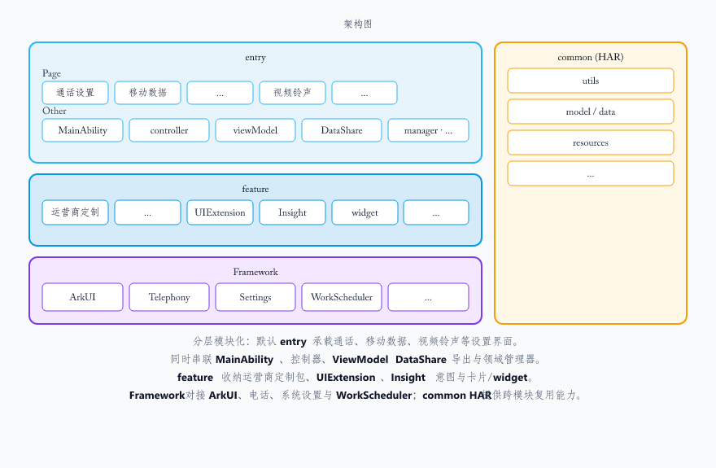

# CallSetting

-   [简介](#section11660541593)
    -   [内容介绍](#section_intro_content_zh)
    -   [架构图](#section_arch_diagram_zh)
-   [目录](#section161941989596)
-   [相关仓](#section1371113476307)

## 简介

### 内容介绍

通话设置应用是 OpenHarmony 标准系统中预置的系统应用，其核心功能围绕来电提醒、铃声管理、通话记录整理、补充业务及网络配置等方面进行了完整实现。

### 核心功能：
   1. **解锁后来电通知**：支持全屏与横幅两种通知样式，用户可根据当前使用场景灵活选择，兼顾沉浸式接听与低打扰需求。
   2. **来电铃声**：提供丰富的铃声设置选项，包括系统铃声、视频铃声，并支持“无铃声”模式，满足用户个性化的来电提醒偏好。
   3. **通话记录合并**：支持按联系人与按时间两种合并方式，帮助用户更高效地浏览和管理通话历史记录，提升信息查找效率。
   4. **IMS补充业务**：集成语音信箱功能，基于 IMS 网络实现非应答场景下的留言服务，增强通信服务的完整性与可靠性。
   5. **未接来电通知**：系统可主动提示未接来电，确保用户及时获知并回拨，避免遗漏重要联系信息。
   6. **来电拒接短信**：用户可在拒接来电时快速发送预设短信，礼貌告知对方无法接听的原因，提升社交沟通礼仪与体验。
   7. **通话设置**：涵盖丰富的话机与网络配置项，包括：快速拨号、通话快捷操作、电源键挂断通话、来电铃声设置页面支持振动开关、移动数据开关、接入点名称（APN）、网络模式。这些设置满足用户对通话习惯、网络连接与运营策略的精细化控制需求。

### 架构图

1. 分层模块化：默认 **entry** 承载通话、移动数据、视频铃声等设置界面。
2. 同时串联 **MainAbility**、控制器、**ViewModel**、**DataShare** 导出与领域管理器。
3. **feature** 收纳运营商定制包、**UIExtension**、**Insight** 意图与卡片/**widget**。
4. **Framework** 对接 **ArkUI**、电话、系统设置与 **WorkScheduler**；**common HAR** 提供跨模块复用能力。

## 目录

~~~
/CallSetting/
├── AppScope                               # 应用级 app.json5 与全局资源
├── common                                 # 公共 HAR（多形态复用逻辑与资源）
│   └── src
│       └── main
│           ├── ets
│           │   ├── data                   # 公共数据结构（如 APN 等）
│           │   ├── model                  # 公共数据模型
│           │   └── utils                  # 公共工具（日志、存储、加解密等）
│           └── resources                  # 公共字符串与媒体资源
├── feature                                # 可插拔特性模块
│   └── cust                               # 运营商/区域定制（HAR）
├── product                                # 按产品形态划分的源码
│   ├── default                            # 手机形态
│   │   └── src
│   │       └── main
│   │           ├── ets
│   │           │   ├── CallBannerUiExtAbility # 通话场景横幅 UI 扩展
│   │           │   ├── CallSettingDialogAbility # 设置类弹窗 UIExtension
│   │           │   ├── CommonPrivacyCenterUIExtAbility # 通用隐私中心 UI 扩展
│   │           │   ├── MainAbility        # 主入口 Ability
│   │           │   ├── NumberIdentityPrivacyStatementUIExtAbility # 号码识别隐私声明 UI
│   │           │   ├── PhonePrivacyStatementUIExtAbility # 电话隐私声明 UI
│   │           │   ├── ServiceAbility     # 通话设置后台服务
│   │           │   ├── WorkSchedulerExtension # 延时上报等 WorkScheduler 扩展
│   │           │   ├── callsetingformability # 通话设置服务卡片 Form
│   │           │   ├── callsettingability # 通话设置 UI 主 Ability
│   │           │   ├── callsettingextability # 通话设置扩展 Ability（DataShare 等）
│   │           │   ├── common                 # 产品侧公共逻辑与组件
│   │           │   ├── components             # 可复用 UI 组件
│   │           │   ├── controller             # 控制器层
│   │           │   ├── data                   # 数据访问与配置装载
│   │           │   ├── datashareability       # 对外 DataShare 能力
│   │           │   ├── manager                # 业务管理器
│   │           │   ├── model                  # 页面与业务数据模型
│   │           │   ├── pages                  # 通话/移动数据等设置页面
│   │           │   ├── service                # 业务服务封装
│   │           │   └── viewModel              # 各设置页视图模型
│   │           └── resources              # 产品形态专属资源
├── signature                              # 签名
└── LICENSE                                # 许可证
~~~

## 相关仓

[**应用程序_通话设置**](https://gitcode.com/openharmony/applications_call.git)

