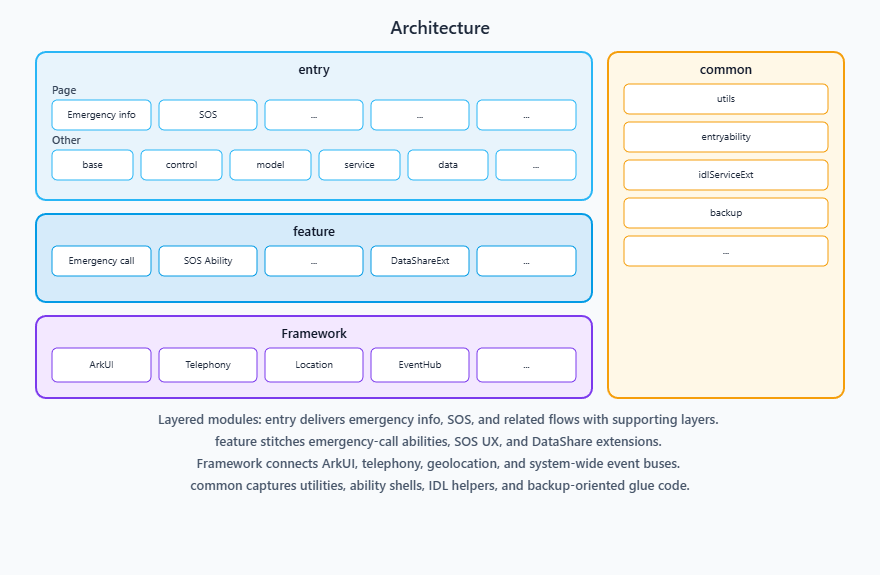

# EmergencyCommunication

-   [Introduction](#section11660541593)
    -   [Content](#section_intro_content_en)
    -   [Architecture diagram](#section_arch_diagram_en)
-   [File Tree](#section161941989596)
-   [Repositories Involved](#section1371113476307)

## Introduction

### Content

The emergency communication application is a pre-installed system application in the OpenHarmony standard system. Its core functions are systematically designed to facilitate rapid assistance and secure communication in emergency situations.

### Core features:
   1. **Emergency Call**: It enables users to make emergency calls even when the device is locked or without a SIM card, ensuring they can quickly contact rescue agencies in critical situations. The current location information of the device is displayed on the call interface, facilitating the rescue party to obtain the user's location promptly.
   2. **Emergency Contacts**: Users can add or delete emergency contacts and set conditions to automatically send help messages or automatically make emergency calls, helping users actively seek help even when they cannot perform manual operations, thereby enhancing security protection capabilities.
   3. **Emergency Dialing**: The emergency dialing interface displays real-time location information, facilitating users or rescue parties to confirm the location. It supports direct dialing of pre-set emergency numbers. Additionally, it provides a quick emergency dialing function. By continuously pressing the power button five times, an emergency call can be triggered, significantly shortening the help path and lowering the operational threshold.

### Architecture diagram

**entry** covers emergency info and SOS UI flows plus control/service/data layers; **feature** groups specialized **Ability / UIExtension / DataShare** extensions and location services; **Framework** stacks ArkUI, telephony, location, and system events; **common** highlights shared entry utilities and IDL extensions aligned with the repository layout.

## File Tree

~~~
/EmergencyCommunication/
├── AppScope
├── entry                 
│   └── src
│       └── main
│           ├── ets                        
│           │   ├── backup
│           │   ├── base
│           │   ├── components
│           │   ├── control
│           │   ├── data
│           │   ├── dialog
│           │   ├── emergencycallability
│           │   ├── emergencydatashareextability
│           │   ├── entryability
│           │   ├── idlServiceExt
│           │   ├── model
│           │   ├── pages
│           │   ├── PersonalSafetySosServiceAbility
│           │   ├── service
│           │   ├── serviceextability
│           │   ├── sosemergencycallability
│           │   ├── soslocationservice
│           │   └── utils
│           └── resources
├── signature
└── LICENSE
~~~

## Repositories Involved

[**applications_emergencycommunication**](https://gitcode.com/openharmony/applications_call.git)
