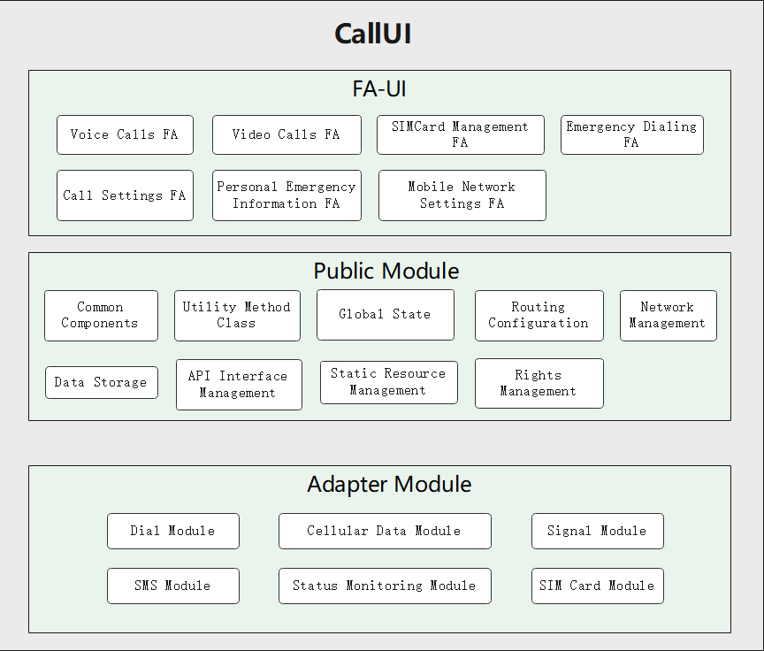

# applications_call

- [Introduction](#section11660541593)
  -   [Architecture](#section78574815486)
- [Directory Structure](#section161941989596)
- [Repositories Involved](#section1371113476307)


## Introduction<a name="section11660541593"></a>

Based on the capabilities of the system platform, design and develop call applications, providing voice calls, video calls, call settings, mobile network settings, SIM card management settings, emergency dialing, and the function of adding personal emergency information. Build models from different perspectives and design the architecture of the call application to ensure that the basic functions are met while ensuring safety, resilience, reliability, privacy, etc.

### Directory Structure<a name="section161941989596"></a>



## Repositories Involved<a name="section1371113476307"></a>

```
/applications
├── callui                                      # Call application master Ability, providing access to the application
│   └── src
│       └── main
│           ├── js                               # js code directory
│               ├── default
│                   ├── assets                   # Picture catalog
│                   ├── i18n                     # Chinese and English configuration
│                   ├── pages                    # Page directory
│                   ├── common                   # Common component or method configuration directory
│                       ├── components           # Public component
│                       ├── constant             # Application Constant Object Directory
│                       ├── utils                # Public method
│               ├── ServiceAbilty                # ServiceAbilty started
│                   ├── callManagerService.js    # ServiceAbilty method
│                   ├── service.js               # ServiceAbilty method
│                   ├── telephonyApi.js          # ServiceAbilty method
│           ├── resources                        # Resource catalog
│           ├── config.json                      # Project configuration information
├── figures                                      # Architecture Diagram Directory
│   └── callui_en.png                            # Architecture design picture
├── signature                                    # Signature file
│   └── com.ohos.callui.p7b                      # com.ohos.callui signature file
```

## Repositories Involved<a name="section1371113476307"></a>

System apps

**applications_standard_call**

