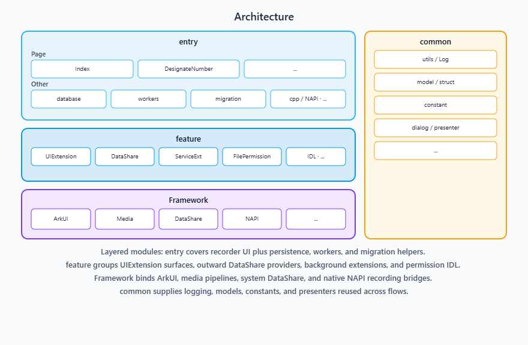
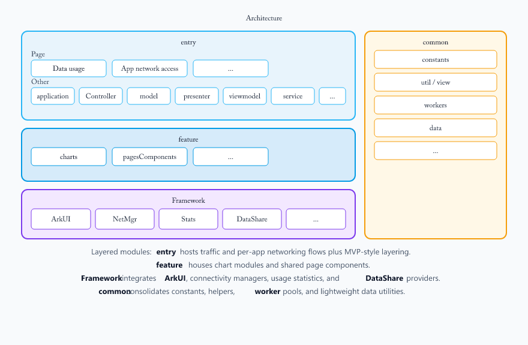

# Applications Call

-   [Introduction](#section11660541593)
    -   [Overview](#section_intro_overview_en)
    -   [callui](#section_module_callui_en)
    -   [CallRecorder](#section_module_callrecorder_en)
    -   [CallSetting](#section_module_callsetting_en)
    -   [CommunicationSetting](#section_module_communicationsetting_en)
    -   [EmergencyCommunication](#section_module_emergency_en)
-   [File Tree](#section161941989596)
-   [Repositories Involved](#section1371113476307)

## Introduction

### Overview

Applications Call is a collection of call-related system applications in the OpenHarmony telephony subsystem. This repository is split into **callui** (in-call UI), **CallRecorder** (call recording), **CallSetting** (call and network settings), **CommunicationSetting** (traffic and connectivity management), and **EmergencyCommunication** (emergency services), together providing voice calls, recording, settings, and emergency assistance capabilities.

---

### callui

#### Content

The call application is a pre-installed system application in the OpenHarmony standard system. Its core functions have been fully realized in aspects such as basic call experience, intelligent interaction, and network adaptation.

### Core features:
1. **Complete basic call functions**: Supports incoming/outgoing calls, answering/disconnecting, and rejecting calls, and integrates audio switching, mute, speaker control, as well as interaction functions such as waiting, adding calls, contact viewing, and digital keypad dialing in the call page, meeting users' needs for all scenarios of daily calls.
2. **Anti-touch mechanism**: Integrates proximity light sensor. During the call, it can automatically lock the screen to prevent accidental touch, improving user experience and avoiding incorrect operations.
3. **Support for high-definition voice calls**: Supports both traditional CS domain calls and VoLTE high-definition voice calls, ensuring a clearer and more stable voice service quality when network conditions permit.
4. **Flight mode call handling**: When attempting to make a call in flight mode, the application will clearly prompt the user to "cancel flight mode" before continuing the call. The logic is clear and conforms to system specifications and user expectations.

#### Architecture diagram

The **entry** block hosts main UI pages plus MVC/MVVM layers; **feature** groups **ServiceAbility**, **UIExtension** surfaces, and **IDL** extensions; **Framework** lists core system stacks (**ArkUI**, **AbilityKit**, **Telephony**, and others); **common** holds shared components, utilities, and assets.

---

### CallRecorder

#### Content

The CallRecorder is a system application prebuilt in OpenHarmony. It provides automatic call recording, designated number recording and etc.

#### Architecture diagram

**entry** hosts UI pages plus database and workers; **feature** groups UIExtension, DataShare, service extensions, and native **NAPI** recording; **Framework** covers ArkUI, media, and system services; **common** shares models, utilities, and presenters.

---

### CallSetting

#### Content

The call settings application is a pre-installed system application in the OpenHarmony standard system. Its core functions have been fully realized in areas such as incoming call notifications, ringtone management, call record organization, supplementary services, and network configuration.

#### Core features:
   1. **Unlock incoming call notifications**: Supports two notification styles - full-screen and banner. Users can flexibly choose according to the current usage scenario, balancing immersive call answering and low-disturbance needs.
   2. **Incoming call ringtone**: Offers a variety of ringtone settings options, including system ringtone, video ringtone, and supports "no ringtone" mode, meeting users' personalized incoming call reminder preferences.
   3. **Call record consolidation**: Supports two consolidation methods - by contact and by time, helping users browse and manage call history records more efficiently, improving information search efficiency.
   4. **IMS supplementary services**: Integrates voicemail function, realizing message service in non-answer scenarios based on IMS network, enhancing the completeness and reliability of communication services.
   5. **Unanswered call notifications**: The system can actively prompt unanswered calls, ensuring users are promptly informed and can return the call, avoiding missing important contact information.
   6. **Incoming call rejection SMS**: Users can quickly send a preset SMS when rejecting a call, politely informing the other party of the reason for not being able to answer, enhancing social communication etiquette and experience.
   7. **Call settings**: Covers a rich set of phone and network configuration items, including: quick dialing, call quick operation, power button to end call, ringtone setting page supports vibration switch, mobile data switch, access point name (APN), network mode. These settings meet users' refined control needs for call habits, network connection and operational strategies.

#### Architecture diagram

1. Layered modules: default **entry** hosts call, mobile data, and video-ringtone surfaces.
2. It also wires **MainAbility**, controllers, **ViewModels**, **DataShare** exports, and domain managers.
3. **feature** captures operator cust packs, **UIExtensions**, **Insight** intents, and widgets.
4. **Framework** binds **ArkUI**, telephony, settings services, and **WorkScheduler**; **common HAR** provides shared cross-module capabilities.

---

### CommunicationSetting

#### Content

The CommunicationSetting is a system application prebuilt in OpenHarmony. It provides traffic statistics, application network access permission control, and related capabilities. **Traffic management** (for example data limit and related policies) is implemented in the **Settings** system application; see the Settings application repository linked below.

#### Architecture diagram

1. Layered modules: **entry** hosts traffic and per-app networking flows plus MVP-style layering.
2. **feature** houses chart modules and shared page components.
3. **Framework** integrates **ArkUI**, connectivity managers, usage statistics, and **DataShare** providers.
4. **common** consolidates constants, helpers, **worker** pools, and lightweight data utilities.

---

### EmergencyCommunication

#### Content

The emergency communication application is a pre-installed system application in the OpenHarmony standard system. Its core functions are systematically designed to facilitate rapid assistance and secure communication in emergency situations.

#### Core features:
   1. **Emergency Call**: It enables users to make emergency calls even when the device is locked or without a SIM card, ensuring they can quickly contact rescue agencies in critical situations. The current location information of the device is displayed on the call interface, facilitating the rescue party to obtain the user's location promptly.
   2. **Emergency Contacts**: Users can add or delete emergency contacts and set conditions to automatically send help messages or automatically make emergency calls, helping users actively seek help even when they cannot perform manual operations, thereby enhancing security protection capabilities.
   3. **Emergency Dialing**: The emergency dialing interface displays real-time location information, facilitating users or rescue parties to confirm the location. It supports direct dialing of pre-set emergency numbers. Additionally, it provides a quick emergency dialing function. By continuously pressing the power button five times, an emergency call can be triggered, significantly shortening the help path and lowering the operational threshold.

#### Architecture diagram

**entry** covers emergency info and SOS UI flows plus control/service/data layers; **feature** groups specialized **Ability / UIExtension / DataShare** extensions and location services; **Framework** stacks ArkUI, telephony, location, and system events; **common** highlights shared entry utilities and IDL extensions aligned with the repository layout.

---

## File Tree

### callui

~~~
/callui/
├── AppScope
├── entry                 
│   └── src
│       └── main
│           ├── ets                        
│           │   ├── Application
│           │   ├── MainAbility
│           │   ├── pages
│           │   ├── common
│           │   ├── controller
│           │   ├── model
│           │   ├── presenter
│           │   ├── viewmodel
│           │   ├── ServiceAbility
│           │   ├── backup
│           │   ├── CallFailedDialogAbility
│           │   ├── IdlServiceExt
│           │   ├── IncomingCallRejectionSmsability
│           │   ├── numberMark
│           │   ├── idl
│           │   └── assets
│           └── resources
├── signature
└── LICENSE
~~~

### CallRecorder

~~~
/CallRecorder/
├── AppScope
├── entry                 
│   └── src
│       └── main
│           ├── cpp
│           │   ├── CMakeLists.txt
│           │   ├── napi
│           │   ├── types
│           │   └── NapiInit.cpp
│           ├── ets                        
│           │   ├── callrecorderuiextability
│           │   ├── common
│           │   ├── datashareextability
│           │   ├── filePermissionExt
│           │   ├── IdlServiceExt
│           │   ├── pages
│           │   ├── serviceextability
│           │   └── workers
│           └── resources
├── signature
└── LICENSE
~~~

### CallSetting

~~~
/CallSetting/
├── AppScope
├── common
│   └── src
│       └── main
│           ├── ets
│           │   ├── data
│           │   ├── model
│           │   └── utils
│           └── resources
├── feature
│   └── cust
├── product
│   ├── default
│   │   └── src
│   │       └── main
│   │           ├── ets
│   │           │   ├── CallBannerUiExtAbility
│   │           │   ├── CallSettingDialogAbility
│   │           │   ├── CommonPrivacyCenterUIExtAbility
│   │           │   ├── MainAbility
│   │           │   ├── NumberIdentityPrivacyStatementUIExtAbility
│   │           │   ├── PhonePrivacyStatementUIExtAbility
│   │           │   ├── ServiceAbility
│   │           │   ├── WorkSchedulerExtension
│   │           │   ├── callsetingformability
│   │           │   ├── callsettingability
│   │           │   ├── callsettingextability
│   │           │   ├── common
│   │           │   ├── components
│   │           │   ├── controller
│   │           │   ├── data
│   │           │   ├── datashareability
│   │           │   ├── manager
│   │           │   ├── model
│   │           │   ├── pages
│   │           │   ├── service
│   │           │   └── viewModel
│   │           └── resources
├── signature
└── LICENSE
~~~

### CommunicationSetting

~~~
/CommunicationSetting/
├── AppScope
├── entry                 
│   └── src
│       └── main
│           ├── ets                        
│           │   ├── application
│           │   ├── constants
│           │   ├── Controller
│           │   ├── data
│           │   ├── entryability
│           │   ├── feature
│           │   ├── model
│           │   ├── pages
│           │   ├── pagesComponents
│           │   ├── presenter
│           │   ├── service
│           │   ├── util
│           │   ├── view
│           │   ├── viewmodel
│           │   └── workers
│           └── resources
├── signature
└── LICENSE
~~~

### EmergencyCommunication

~~~
/EmergencyCommunication/
├── AppScope
├── entry                 
│   └── src
│       └── main
│           ├── ets                        
│           │   ├── backup
│           │   ├── base
│           │   ├── components
│           │   ├── control
│           │   ├── data
│           │   ├── dialog
│           │   ├── emergencycallability
│           │   ├── emergencydatashareextability
│           │   ├── entryability
│           │   ├── idlServiceExt
│           │   ├── model
│           │   ├── pages
│           │   ├── PersonalSafetySosServiceAbility
│           │   ├── service
│           │   ├── serviceextability
│           │   ├── sosemergencycallability
│           │   ├── soslocationservice
│           │   └── utils
│           └── resources
├── signature
└── LICENSE
~~~

## Repositories Involved

[**applications_call**](https://gitcode.com/openharmony/applications_call.git)

[**applications_settings**](https://gitcode.com/openharmony/applications_settings.git) (Settings system application; hosts **traffic management** source code)
