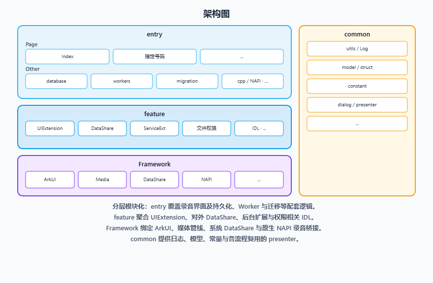
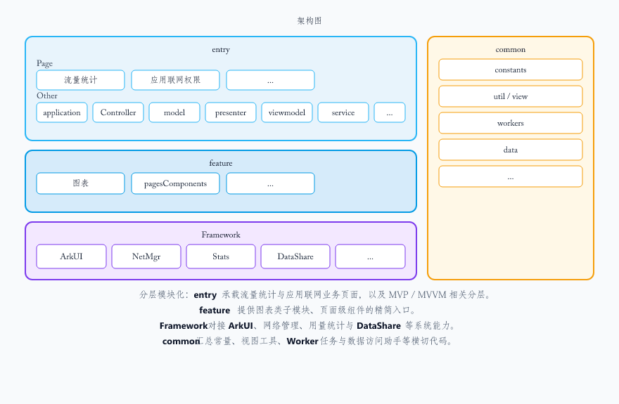
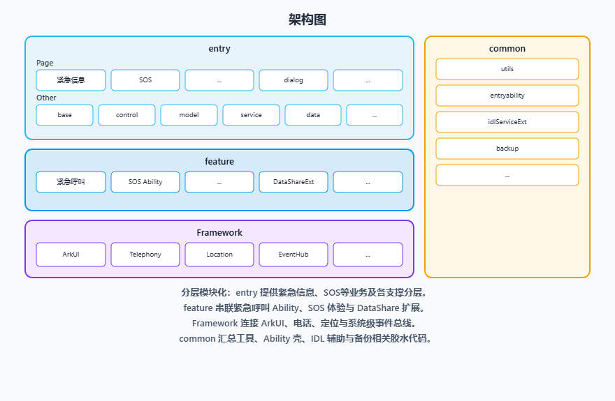

# Applications Call

-   [简介](#section11660541593)
    -   [合集说明](#section_intro_overview_zh)
    -   [callui](#section_module_callui_zh)
    -   [CallRecorder](#section_module_callrecorder_zh)
    -   [CallSetting](#section_module_callsetting_zh)
    -   [CommunicationSetting](#section_module_communicationsetting_zh)
    -   [EmergencyCommunication](#section_module_emergency_zh)
-   [目录](#section161941989596)
-   [相关仓](#section1371113476307)

## 简介

### 合集说明

Applications Call 是 OpenHarmony 电话子系统中与通话相关的系统应用集合，本仓库按模块划分为 **callui**（通话界面）、**CallRecorder**（通话录音）、**CallSetting**（通话与网络设置）、**CommunicationSetting**（流量与联网管理）、**EmergencyCommunication**（紧急通信）等子工程，统一提供语音通话、录音、设置与紧急求助等能力。

---

### callui

#### 内容介绍

通话应用是 OpenHarmony 标准系统中预置的系统应用，其核心功能围绕基础通话体验、智能交互与网络适配等方面进行了完整实现。

### 核心功能：
   1. **通话基础功能完备**:支持来/去电、接听/挂断、拒接等基本通话操作，并集成音频切换、静音、扬声器控制以及通话页面中的等待、添加通话、联系人查看、数字键盘拨号等交互功能，满足用户日常通话全场景需求。
   2. **防触碰机制**:集成接近光传感器，通话过程中可自动锁屏防误触，提升用户体验并避免误操作。
   3. **高清语音通话支持**:同时支持传统 CS 域通话与 VoLTE 高清语音通话，确保在网络条件允许时提供更清晰、稳定的语音服务质量。
   4. **飞行模式拨号处理**：在飞行模式下尝试拨号时，应用会明确提示用户需“取消飞行模式”后方可继续呼叫，逻辑清晰，符合系统规范与用户预期。

#### 架构图

主界面与页面位于 **entry** 内；**ServiceAbility**、各类 **UIExtension** 与 **IDL 扩展**等可插拔能力归入 **feature**；**ArkUI、AbilityKit、电话子系统**等系统能力归入 **Framework**；公共组件、工具与资源归入 **common**。整体与 MVP / MVVM 分层思路结合使用。

---

### CallRecorder

#### 内容介绍

通话录音应用是 OpenHarmony 标准系统中预置的系统应用，为用户提供通话自动录音、指定号码录音等功能。

#### 架构图

**entry** 承载页面与数据库、Worker 等支撑代码；**feature** 汇总 UIExtension、DataShare、服务扩展与 **C++/NAPI** 录音能力；**Framework** 为 ArkUI、媒体、DataShare 等系统栈；**common** 为公共模型、工具与展示逻辑。

---

### CallSetting

#### 内容介绍

通话设置应用是 OpenHarmony 标准系统中预置的系统应用，其核心功能围绕来电提醒、铃声管理、通话记录整理、补充业务及网络配置等方面进行了完整实现。

#### 核心功能：
   1. **解锁后来电通知**：支持全屏与横幅两种通知样式，用户可根据当前使用场景灵活选择，兼顾沉浸式接听与低打扰需求。
   2. **来电铃声**：提供丰富的铃声设置选项，包括系统铃声、视频铃声，并支持“无铃声”模式，满足用户个性化的来电提醒偏好。
   3. **通话记录合并**：支持按联系人与按时间两种合并方式，帮助用户更高效地浏览和管理通话历史记录，提升信息查找效率。
   4. **IMS补充业务**：集成语音信箱功能，基于 IMS 网络实现非应答场景下的留言服务，增强通信服务的完整性与可靠性。
   5. **未接来电通知**：系统可主动提示未接来电，确保用户及时获知并回拨，避免遗漏重要联系信息。
   6. **来电拒接短信**：用户可在拒接来电时快速发送预设短信，礼貌告知对方无法接听的原因，提升社交沟通礼仪与体验。
   7. **通话设置**：涵盖丰富的话机与网络配置项，包括：快速拨号、通话快捷操作、电源键挂断通话、来电铃声设置页面支持振动开关、移动数据开关、接入点名称（APN）、网络模式。这些设置满足用户对通话习惯、网络连接与运营策略的精细化控制需求。

#### 架构图

1. 分层模块化：默认 **entry** 承载通话、移动数据、视频铃声等设置界面。
2. 同时串联 **MainAbility**、控制器、**ViewModel**、**DataShare** 导出与领域管理器。
3. **feature** 收纳运营商定制包、**UIExtension**、**Insight** 意图与卡片/**widget**。
4. **Framework** 对接 **ArkUI**、电话、系统设置与 **WorkScheduler**；**common HAR** 提供跨模块复用能力。

---

### CommunicationSetting

#### 内容介绍

通信设置应用是 OpenHarmony 标准系统中预置的系统应用，为用户提供流量统计、应用联网权限控制等功能。**流量管理**（如套餐限额、策略控制等相关能力）的代码位于**设置**系统应用中，请参阅下方「相关仓」中的设置应用仓链接。

#### 架构图

1. 分层模块化：**entry** 承载流量统计与应用联网业务页面，以及 MVP / MVVM 相关分层。
2. **feature** 提供图表类子模块、页面级组件的精简入口。
3. **Framework** 对接 **ArkUI**、网络管理、用量统计与 **DataShare** 等系统能力。
4. **common** 汇总常量、视图工具、**Worker** 任务与数据访问助手等横切代码。

---

### EmergencyCommunication

#### 内容介绍

紧急通信应用是 OpenHarmony 标准系统中预置的系统应用，其核心功能围绕紧急情况下的快速求助与安全通信进行了系统化设计。

#### 核心功能：
   1. **紧急通话**：支持在锁屏或无SIM卡状态下拨打紧急号码，确保用户在危急时刻能够快速联系救援机构；同时可在通话界面显示设备当前的位置信息，便于救援方及时获取用户所在地。
   2. **紧急联系人**：允许用户添加或删除紧急联系人，并可设置触发条件后自动发送求助信息或自动拨打求助电话，帮助用户在无法手动操作时仍能主动向外求助，提升安全保障能力。
   3. **紧急拨号**：紧急拨号界面支持实时显示位置信息，便于用户或救援方确认方位；支持直接拨打预设的紧急号码；同时提供快速紧急拨号功能，通过连续按5次电源键即可触发紧急呼叫，显著缩短求助路径，降低操作门槛。

#### 架构图

**entry** 承载紧急信息与 SOS 等业务页与控制/服务/数据分层；**feature** 汇总各类 **Ability / UIExtension / DataShare** 与定位、IDL 扩展；**Framework** 依赖 ArkUI、电话、位置与公共事件等系统能力；右侧 **common** 在架构示意中归组入口、工具与 IDL 等横切能力。

---

## 目录

### callui

~~~
/callui/
├── AppScope                               # 应用级 app.json5 与全局资源
├── entry                                  # 主入口模块
│   └── src
│       └── main
│           ├── ets                        # ArkTS 业务与 Ability 源码
│           │   ├── Application            # 应用入口与生命周期
│           │   ├── MainAbility            # 主界面 Ability
│           │   ├── pages                  # 通话相关页面
│           │   ├── common                 # 公共组件、常量与工具
│           │   ├── controller             # 控制器（界面与业务衔接）
│           │   ├── model                  # 数据模型与状态
│           │   ├── presenter              # 展示层业务逻辑
│           │   ├── viewmodel              # 视图模型（MVVM）
│           │   ├── ServiceAbility         # 通话后台服务 Ability
│           │   ├── backup                 # 通话数据备份与恢复
│           │   ├── CallFailedDialogAbility # 通话失败提示（UIExtension 弹窗）
│           │   ├── IdlServiceExt          # IDL 服务扩展（跨进程接口）
│           │   ├── IncomingCallRejectionSmsability # 来电拒接短信等 UIExtension
│           │   ├── numberMark             # 号码标记与展示相关逻辑
│           │   ├── idl                    # IDL 接口定义与桩实现
│           │   └── assets                 # 内置图片等静态资源
│           └── resources                  # 资源配置文件存放目录
├── signature                              # 签名
└── LICENSE                                # 许可证
~~~

### CallRecorder

~~~
/CallRecorder/
├── AppScope                               # 应用级 app.json5 与全局资源
├── entry                                  # 主入口模块（UI、DataShare、服务扩展）
│   └── src
│       └── main
│           ├── cpp                        # C++ 原生与 NAPI 桥接
│           │   ├── CMakeLists.txt         # CMake 构建配置
│           │   ├── napi                   # NAPI 实现源码
│           │   ├── types                  # ArkTS 侧类型声明等
│           │   └── NapiInit.cpp           # NAPI 模块注册入口
│           ├── ets                        # ArkTS 业务与 Ability 源码
│           │   ├── callrecorderuiextability # 通话录音界面 UIExtension Ability
│           │   ├── common                   # 公共组件、常量与工具类
│           │   ├── datashareextability      # 对外 DataShare 数据访问
│           │   ├── filePermissionExt        # 录音文件权限相关 IDL 扩展
│           │   ├── IdlServiceExt            # 与系统通话子系统 IDL 交互
│           │   ├── pages                    # 设置与文件列表等页面
│           │   ├── serviceextability        # 后台服务扩展（备份、权限等）
│           │   └── workers                  # 耗时任务 Worker 线程
│           └── resources                  # 资源配置文件存放目录
├── signature                              # 签名
└── LICENSE                                # 许可证
~~~

### CallSetting

~~~
/CallSetting/
├── AppScope                               # 应用级 app.json5 与全局资源
├── common                                 # 公共 HAR（多形态复用逻辑与资源）
│   └── src
│       └── main
│           ├── ets
│           │   ├── data                   # 公共数据结构（如 APN 等）
│           │   ├── model                  # 公共数据模型
│           │   └── utils                  # 公共工具（日志、存储、加解密等）
│           └── resources                  # 公共字符串与媒体资源
├── feature                                # 可插拔特性模块
│   └── cust                               # 运营商/区域定制（HAR）
├── product                                # 按产品形态划分的源码
│   ├── default                            # 手机形态
│   │   └── src
│   │       └── main
│   │           ├── ets
│   │           │   ├── CallBannerUiExtAbility # 通话场景横幅 UI 扩展
│   │           │   ├── CallSettingDialogAbility # 设置类弹窗 UIExtension
│   │           │   ├── CommonPrivacyCenterUIExtAbility # 通用隐私中心 UI 扩展
│   │           │   ├── MainAbility        # 主入口 Ability
│   │           │   ├── NumberIdentityPrivacyStatementUIExtAbility # 号码识别隐私声明 UI
│   │           │   ├── PhonePrivacyStatementUIExtAbility # 电话隐私声明 UI
│   │           │   ├── ServiceAbility     # 通话设置后台服务
│   │           │   ├── WorkSchedulerExtension # 延时上报等 WorkScheduler 扩展
│   │           │   ├── callsetingformability # 通话设置服务卡片 Form
│   │           │   ├── callsettingability # 通话设置 UI 主 Ability
│   │           │   ├── callsettingextability # 通话设置扩展 Ability（DataShare 等）
│   │           │   ├── common                 # 产品侧公共逻辑与组件
│   │           │   ├── components             # 可复用 UI 组件
│   │           │   ├── controller             # 控制器层
│   │           │   ├── data                   # 数据访问与配置装载
│   │           │   ├── datashareability       # 对外 DataShare 能力
│   │           │   ├── manager                # 业务管理器
│   │           │   ├── model                  # 页面与业务数据模型
│   │           │   ├── pages                  # 通话/移动数据等设置页面
│   │           │   ├── service                # 业务服务封装
│   │           │   └── viewModel              # 各设置页视图模型
│   │           └── resources              # 产品形态专属资源
├── signature                              # 签名
└── LICENSE                                # 许可证
~~~

### CommunicationSetting

~~~
/CommunicationSetting/
├── AppScope                               # 应用级 app.json5 与全局资源
├── entry                                  # 默认形态主模块
│   └── src
│       └── main
│           ├── ets                        
│           │   ├── application            # Application 与全局初始化
│           │   ├── constants              # 业务与 UI 常量
│           │   ├── Controller             # MVC 控制器
│           │   ├── data                   # 流量统计等数据层
│           │   ├── entryability           # UIAbility / ExtensionAbility 入口
│           │   ├── feature                # 图表、流量曲线等功能子模块
│           │   ├── model                  # 业务模型与数据结构
│           │   ├── pages                  # 流量、联网管理等业务页面
│           │   ├── pagesComponents        # 页面级可复用组件
│           │   ├── presenter              # MVP 展示器
│           │   ├── service                # 后台服务与系统接口封装
│           │   ├── util                   # 工具与格式化函数
│           │   ├── view                   # 自定义视图与绘制
│           │   ├── viewmodel              # MVVM 视图模型
│           │   └── workers                # 统计聚合等 Worker 任务
│           └── resources                  # 字符串、媒体与主题资源
├── signature                              # 签名
└── LICENSE                                # 许可证
~~~

### EmergencyCommunication

~~~
/EmergencyCommunication/
├── AppScope                               # 应用级 app.json5 与全局资源
├── entry                                  # 主入口模块
│   └── src
│       └── main
│           ├── ets                        
│           │   ├── backup                 # 个人紧急信息等备份扩展
│           │   ├── base                   # 基础类型、路由与公共基类
│           │   ├── components             # 业务通用 UI 组件
│           │   ├── control                # 控制层（流程与交互编排）
│           │   ├── data                   # 数据访问与仓库实现
│           │   ├── dialog                 # 各类业务弹窗页面
│           │   ├── emergencycallability   # 紧急呼叫主 Ability
│           │   ├── emergencydatashareextability # 紧急信息 DataShare 扩展
│           │   ├── entryability           # 主 UIAbility / Extension 入口
│           │   ├── idlServiceExt          # 与系统服务 IDL 扩展交互
│           │   ├── model                  # 业务实体与状态模型
│           │   ├── pages                  # 紧急信息、SOS 等页面
│           │   ├── PersonalSafetySosServiceAbility # 个人安全 SOS 后台服务
│           │   ├── service                # 系统 API 封装
│           │   ├── serviceextability      # 通用服务扩展 Ability
│           │   ├── sosemergencycallability # SOS 紧急呼叫 UIExtension
│           │   ├── soslocationservice     # SOS 联动定位服务
│           │   └── utils                  # 日志、权限、格式化等工具
│           └── resources                  # 资源配置文件存放目录
├── signature                              # 签名
└── LICENSE                                # 许可证
~~~

## 相关仓

[**applications_call**](https://gitcode.com/openharmony/applications_call.git)

[**应用程序_设置**](https://gitcode.com/openharmony/applications_settings.git)（设置系统应用；**流量管理**相关源码位于该仓）
