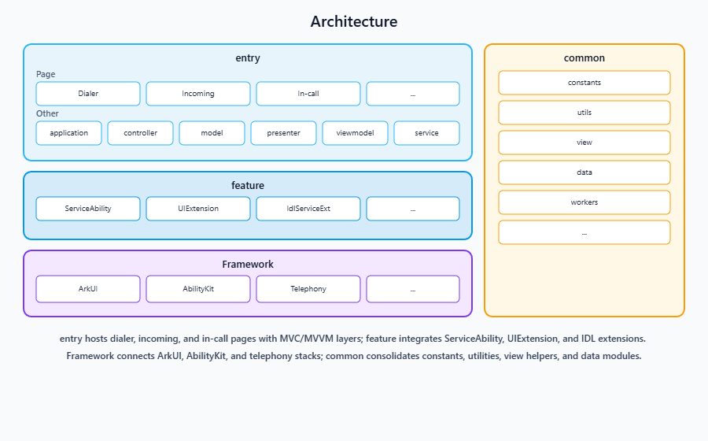

# CallUI

-   [Introduction](#section11660541593)
    -   [Content](#section_intro_content_en)
    -   [Architecture diagram](#section48896451454)
-   [File Tree](#section161941989596)
-   [Repositories Involved](#section1371113476307)

## Introduction

### Content

The call application is a pre-installed system application in the OpenHarmony standard system. Its core functions have been fully realized in aspects such as basic call experience, intelligent interaction, and network adaptation.

### Core features:
   1. **Complete basic call functions**: Supports incoming/outgoing calls, answering/disconnecting, and rejecting calls, and integrates audio switching, mute, speaker control, as well as interaction functions such as waiting, adding calls, contact viewing, and digital keypad dialing in the call page, meeting users' needs for all scenarios of daily calls.
   2. **Anti-touch mechanism**: Integrates proximity light sensor. During the call, it can automatically lock the screen to prevent accidental touch, improving user experience and avoiding incorrect operations.
   3. **Support for high-definition voice calls**: Supports both traditional CS domain calls and VoLTE high-definition voice calls, ensuring a clearer and more stable voice service quality when network conditions permit.
   4. **Flight mode call handling**: When attempting to make a call in flight mode, the application will clearly prompt the user to "cancel flight mode" before continuing the call. The logic is clear and conforms to system specifications and user expectations.

### Architecture diagram

The **entry** block hosts main UI pages plus MVC/MVVM layers; **feature** groups **ServiceAbility**, **UIExtension** surfaces, and **IDL** extensions; **Framework** lists core system stacks (**ArkUI**, **AbilityKit**, **Telephony**, and others); **common** holds shared components, utilities, and assets.

## File Tree

~~~
/CallUI/
├── AppScope
├── entry                 
│   └── src
│       └── main
│           ├── ets                        
│           │   ├── Application
│           │   ├── MainAbility
│           │   ├── pages
│           │   ├── common
│           │   ├── controller
│           │   ├── model
│           │   ├── presenter
│           │   ├── viewmodel
│           │   ├── ServiceAbility
│           │   ├── backup
│           │   ├── CallFailedDialogAbility
│           │   ├── IdlServiceExt
│           │   ├── IncomingCallRejectionSmsability
│           │   ├── numberMark
│           │   ├── idl
│           │   └── assets
│           └── resources
├── signature
└── LICENSE
~~~

## Repositories Involved

[**callui**](https://gitcode.com/openharmony/applications_call.git)
