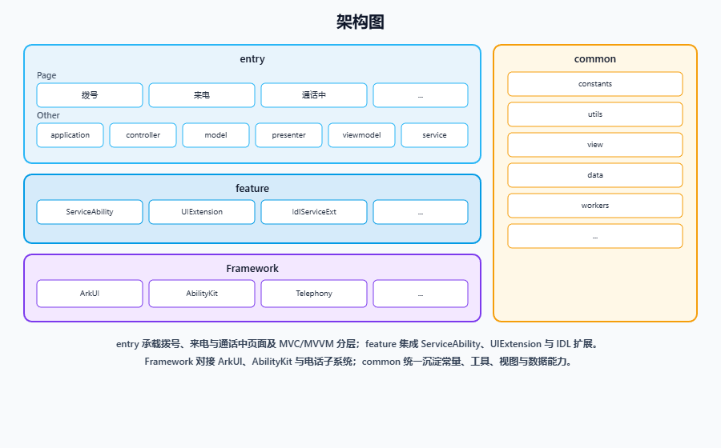

# CallUI

-   [简介](#section11660541593)
    -   [内容介绍](#section_intro_content_zh)
    -   [架构图](#section48896451454)
-   [目录](#section161941989596)
-   [相关仓](#section1371113476307)

## 简介

### 内容介绍

通话应用是 OpenHarmony 标准系统中预置的系统应用，其核心功能围绕基础通话体验、智能交互与网络适配等方面进行了完整实现。

### 核心功能：
   1. **通话基础功能完备**:支持来/去电、接听/挂断、拒接等基本通话操作，并集成音频切换、静音、扬声器控制以及通话页面中的等待、添加通话、联系人查看、数字键盘拨号等交互功能，满足用户日常通话全场景需求。
   2. **防触碰机制**:集成接近光传感器，通话过程中可自动锁屏防误触，提升用户体验并避免误操作。
   3. **高清语音通话支持**:同时支持传统 CS 域通话与 VoLTE 高清语音通话，确保在网络条件允许时提供更清晰、稳定的语音服务质量。
   4. **飞行模式拨号处理**：在飞行模式下尝试拨号时，应用会明确提示用户需“取消飞行模式”后方可继续呼叫，逻辑清晰，符合系统规范与用户预期。

### 架构图

主界面与页面位于 **entry** 内；**ServiceAbility**、各类 **UIExtension** 与 **IDL 扩展**等可插拔能力归入 **feature**；**ArkUI、AbilityKit、电话子系统**等系统能力归入 **Framework**；公共组件、工具与资源归入 **common**。整体与 MVP / MVVM 分层思路结合使用。

## 目录

~~~
/CallUI/
├── AppScope                               # 应用级 app.json5 与全局资源
├── entry                                  # 主入口模块
│   └── src
│       └── main
│           ├── ets                        # ArkTS 业务与 Ability 源码
│           │   ├── Application            # 应用入口与生命周期
│           │   ├── MainAbility            # 主界面 Ability
│           │   ├── pages                  # 通话相关页面
│           │   ├── common                 # 公共组件、常量与工具
│           │   ├── controller             # 控制器（界面与业务衔接）
│           │   ├── model                  # 数据模型与状态
│           │   ├── presenter              # 展示层业务逻辑
│           │   ├── viewmodel              # 视图模型（MVVM）
│           │   ├── ServiceAbility         # 通话后台服务 Ability
│           │   ├── backup                 # 通话数据备份与恢复
│           │   ├── CallFailedDialogAbility # 通话失败提示（UIExtension 弹窗）
│           │   ├── IdlServiceExt          # IDL 服务扩展（跨进程接口）
│           │   ├── IncomingCallRejectionSmsability # 来电拒接短信等 UIExtension
│           │   ├── numberMark             # 号码标记与展示相关逻辑
│           │   ├── idl                    # IDL 接口定义与桩实现
│           │   └── assets                 # 内置图片等静态资源
│           └── resources                  # 资源配置文件存放目录
├── signature                              # 签名
└── LICENSE                                # 许可证
~~~

## 相关仓

[**通话应用**](https://gitcode.com/openharmony/applications_call.git)
